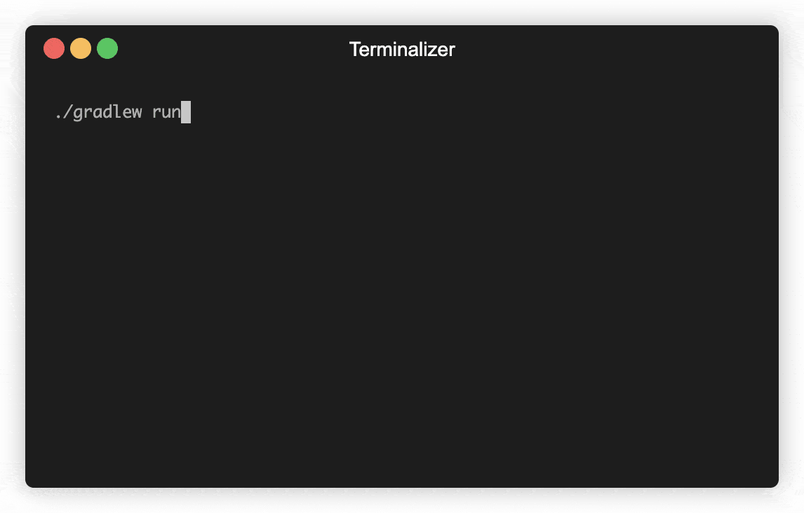

# elsim - elevator simulator

Simulates multiple elevators of a building as threads powered by a global finishing-time-minimization heuristics.

## Description

### Elevator strategy

A request to the system consists of its origin floor and its destination floor. An elevator fulfills requests along its directional ride by picking up waiting requests at their origins and dropping loaded requests at their destinations. If no request could be fulfilled in its current moving direction the elevator changes direction and continues fulfilling requests. If no requests need to be fulfilled, the elevator suspends as waiting thread until notified about new requests.

### Scheduling strategy

Each request is sent to all elevators for cost prediction. The elevator which returns minimal costs is chosen to fulfill the request. Currently, these costs are equal to the time to finish all currently pending requests of this elevator plus the additional costs to fulfill the new request. The finishing time increases per stop and per traveled floor. This minimization strategy leads to the fulfillment of a request by the elevator which can most 'easily' fulfill the requests. This means a request will more likely be fulfilled by an elevator which is already on a floor nearby and already stopping on the necessary pickup/dropoff floor anyway.

### Extensibility

Additionally, the implemented data model enables the extensibility to possibly include further parameters into the cost function for better scheduling decisions. For example, this could include the sum of individual fulfillment time of a request or penalty costs for packed elevators.

### Features

* Multithreading
* Generic cost optimization design
* Efficient request queueing by ordering and grouping requests by origin/destination floor
* Full test coverage

### Main simulation

The main method executes the simulation by creating random requests at random times in fast forward. Each elevator logs its current status change as a line into the standard output. Each line includes the current time, the ID of the elevator prefixed with an `E`, the current floor, and the status change. A status message of an elevator can be the acceptance of a new request, the loading/unloading of a request with a prefixed `+`/`-`, or the suspension/start of the elevator. Each request is logged with its ID (prefixed with an `R`) and its origin and destination floor with an `>` in between.



## Getting Started

The following instructions will download, build, run, and test this project on your system.

### Prerequisites

Install the newest JDK, for example, OpenJDK14.

### Download

Clone the repository into your current directory and open it.
```
git clone https://github.com/thoebert/elsim.git
cd elsim
```

### Build & Run

The project includes Gradle as a build system, which automatically retrieves the necessary dependencies.
```
./gradlew run
```

### Running the tests

Run all tests with the gradle task 'test'
```
./gradlew test
```

## Built With

* [Gradle 6](https://gradle.org//) - Build system
* [Junit 5](https://junit.org/) - Testing framework

## Contributing

Feel free to open a new issue/pull-request about any possible improvement. 

## Author

* [Timon Höbert](https://github.com/thoebert)

## License

This project is licensed under the GNU GPLv3 License - see the [License.md](License.md) file for details.
